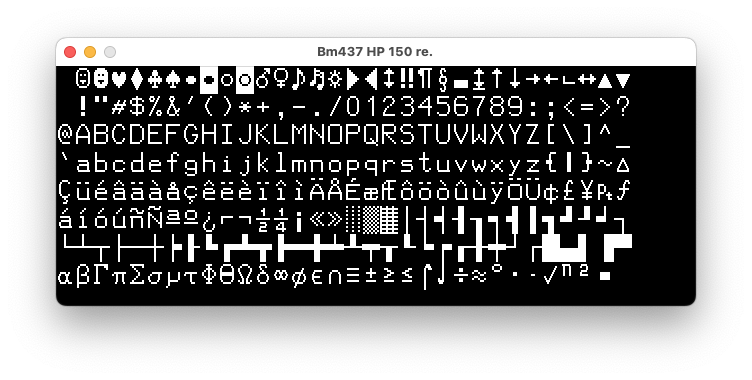

libwinfont
==========

C library for reading Windows Bitmap FON font files. Windows bitmap
fonts are great for retro games and old school console/computer
emulators etc.

Usage
=====

View a glyph in a font file as ASCII art

    $ winfontinfo -c 232 Bm437_Rainbow100_re_66.FON

Draws the capital letter phi

     ██████
       ██
     ██████
    ██ ██ ██
    ██ ██ ██
     ██████
       ██
     ██████

View every glyph rendered with SDL

    $ ./wfview Bm437_HP_150_re.FON

Opens a window and renders every glyph

Build
=====

Verbose build

    $ make V=1

View man pages

    $ man -M . libwinfont
    $ man -M . winfontinfo

Install to a different PREFIX (default is $HOME)

    $ make PREFIX=/usr/local
    $ make PREFIX=/usr/local install

Code Page 437
=============

For Windows Bitmap fonts we're mostly concerned with CP437 (aka
IBM437, CSPC8CODEPAGE437, or just 437).

Convert a file from CP437 to UTF8

    $ iconv -f CP437 -t UTF-8 README.NFO > README.txt

And back to UTF8

    $ iconv -f UTF-8 -t CP437 README.txt > README.NFO
